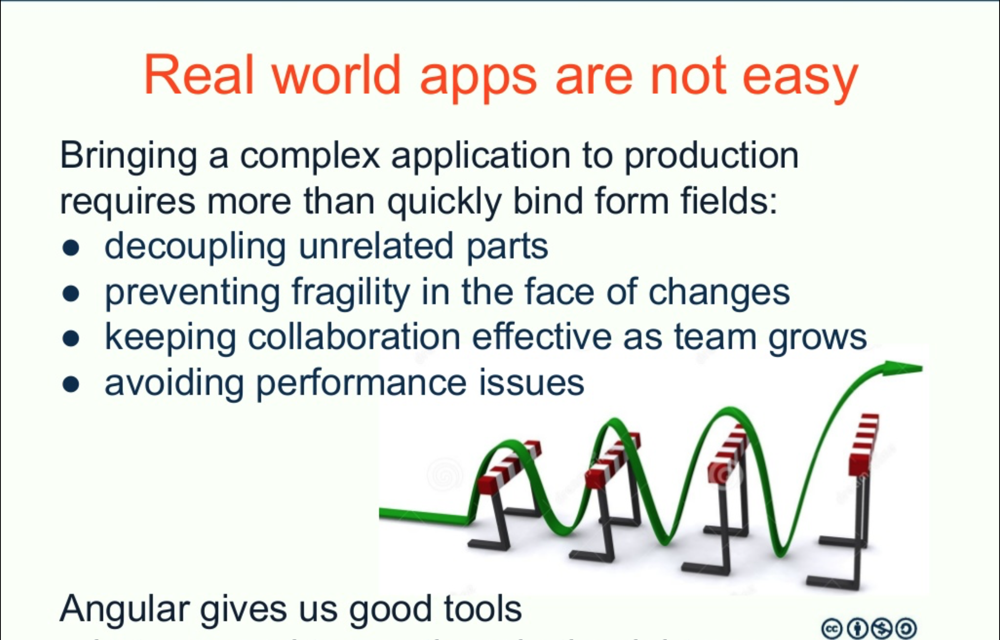
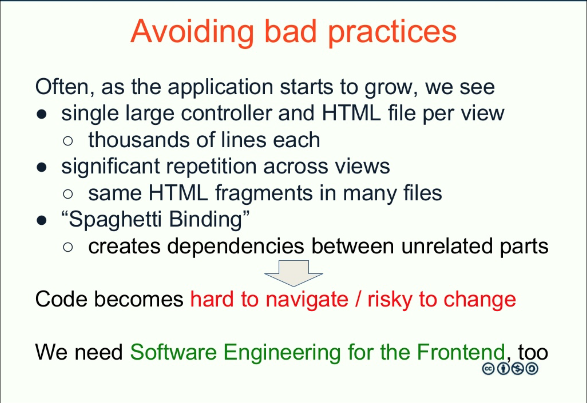
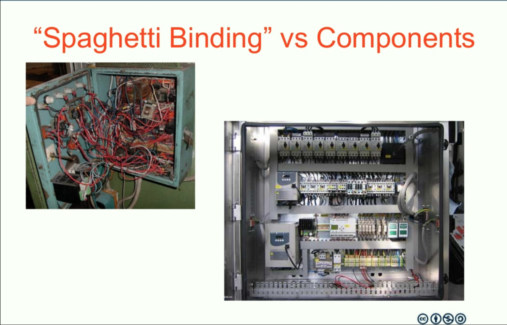
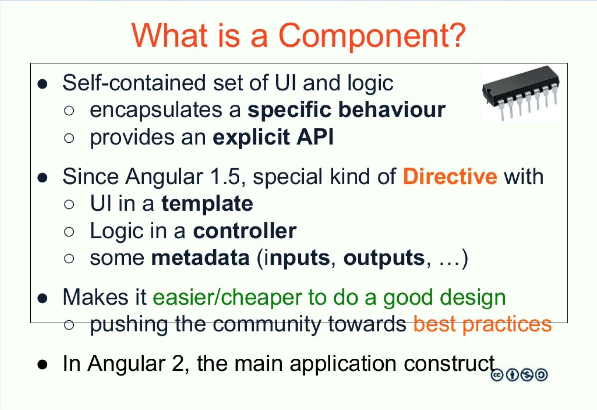
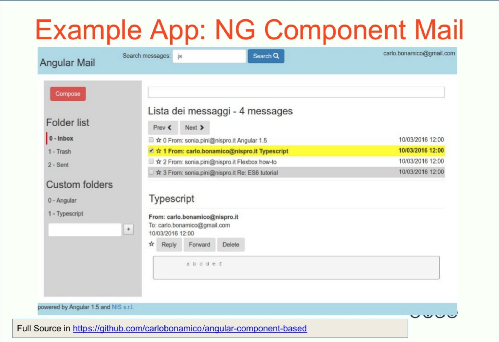
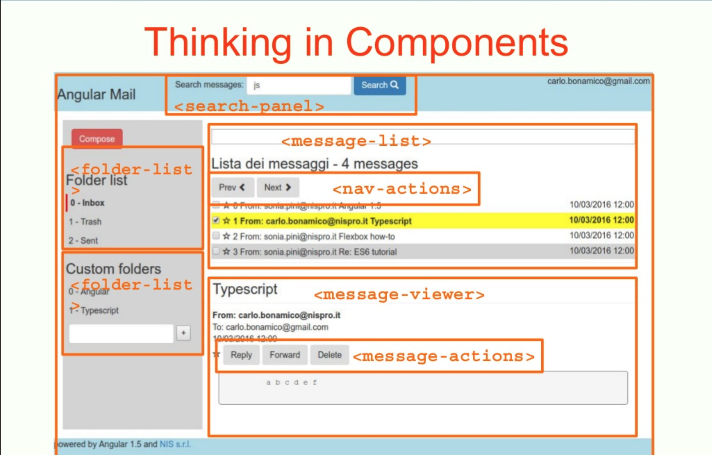
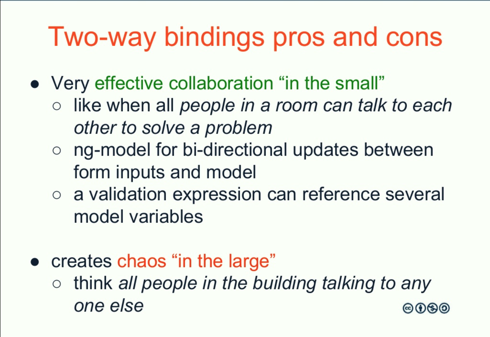
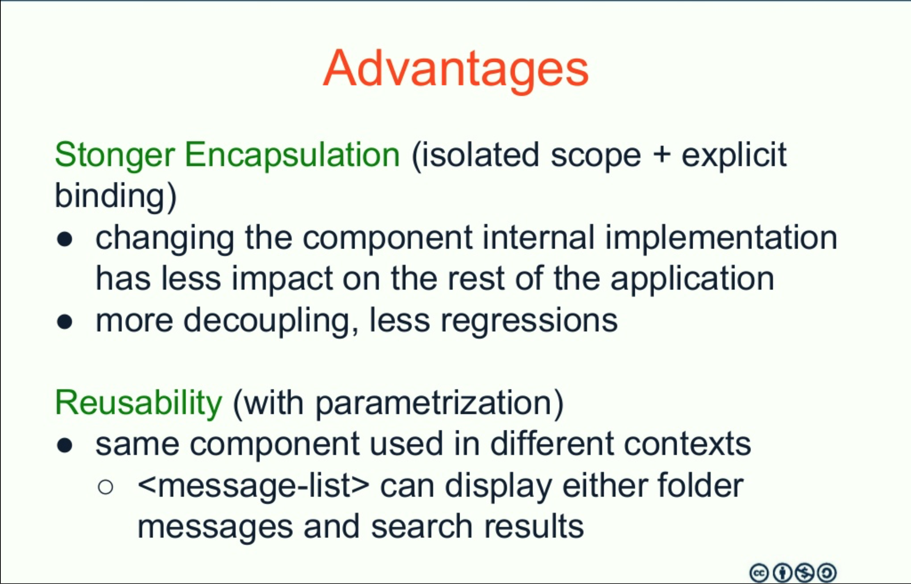
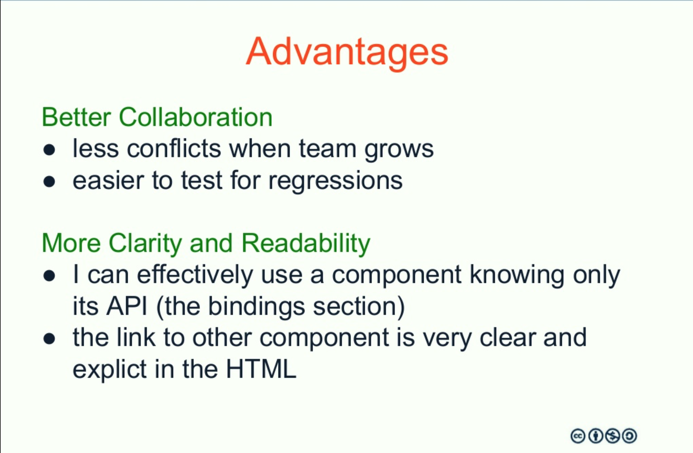

# PART 1 - Introduction to Angular 2


## TOPICS
* How does our code become unmanageable? A practical example
* Issues and challenges in developing complex / large HTML5 applications
* Huge controllers and "scope soup"


## Feature Pressure

### Working Prototype != Production-Ready


## What often happens
* huge files
* deep interconnections between features
* cross-cutting mechanisms "spread" everywhere
* fragility
* risk of change increases
* productivity decreases over time











# Thinking In Components


## TOPICS
* From huge controllers and "scope soup" to Component-based Uis
* How to identify application Components


# Thinking in Components
* Learn to split a single "View" or "Page" from the user perspective into a hierarchy of Components
From huge controllers and "scope soup" to Component-based Uis
* How to identify application Components





## Let's try
* Let's focus on UI Components
* Analyze the http://www.trenitalia.com website

TIP: use a screen capture and annotation tool such as https://qsnapnet.com/


## Types of components
* UI Components
  * individual input / output widgets
  * more complex widgets
  * user-level features 
  * entire "pages"
* Non-Graphical Components


## LAB
* Identify key components in a typical WebMail application
* Analyze which components can be reused in multiple views

* Identify key inputs and outputs for each component
* Now go find even more components

















# Component-based development with Angular


## TOPICS
* Angular 2 Component model and API
* How to develop a simple Component in Angular 2


## The Issues

* up to Angular 1.4.x, developing Component-Based Applications was possible, but 
  * NOT easy
  * required additional effort
  * "handcraft" a ``directive`` following a number of criteria


## Enter Angular 2
* The only way is to do Components
* even the application is a component

* big syntax simplification
  * improved readability
  * less effort

* Typescript


## Angular 2 Components API
* declaring components ``@Component`` 
* defining the component interface with ``inputs, outputs`` inside ``@Component`` annotation
* manage the component lifecycle with ``ngOnInit``, ``ngOnChanges`` and ``ngOnDestroy``
* linking components with each other

_as always, embracing HTML_ 


## Aside - Components vs HTML elements

```html
  <nav class="page-left-menu">
            
      <section class="compose-toolbar">
          <button (click)="compose()" class="btn btn-danger">Compose</button>
      </section>
      
      <section class="folder-list">
          
          <folder-list 
              [folders]="folders" 
              [defaultFolder]="defaultFolder"
              (selected)="selectFolder($event.folder)">
          </folder-list>
          
      </section>
  </nav>
```
How can it possibly work? 


## So, in HTML
* custom nodes are 
  * managed within the DOM 
  * styled with CSS
  * processed with JS

Angular builds on that and tries to integrate its component model with HTML as much as possible


## Our first component

A minimal ``<hello></hello>`` component

```typescript
import { Component } from '@angular/core';

@Component({selector: 'hello', 
    template: "<h3>Hello World</h3>",
})
export class HelloWorldComponent  {}

```

in the page
```html
<body>
  <hello></hello>
</body>
```


## LAB 01
Create the ``<mail-logo>`` component

In the base application inside the labs folder you will find the ``mail-logo`` folder
containing an empty scheleton of component

* the html template is already done
* complete the component definition on mail-logo.ts
* import the component in the app.ts file.


Remember: TEST the page at each step


## Tips
* use ``templateUrl`` into the Component annotation to address the right template
* import the component into app.ts

```typescript 
import {MailLogoComponent} from "components/mail-logo/mail-logo.ts"
```

* add the component to the module declarations (app.ts)


## What's in a Component? 
* a selector, to reference it in HTML 
  * a tag name in the simplest case 

* some HTML
  * inline, with ``template``
  * in an external file, with ``templateUrl``
  * dynamic (inputs, outputs)
* the Component Class


# Beyond Hello World
This is already useful to reduce duplication in our pages, but to be useful, the component must be able to interact with the user and with the rest of the page


## The main page controller
Who is passing inputs to the other components?
Role of the ``MailView`` component
* interact with backend services
* provide data to the individual components
* coordinate page elements

A look at the code...


## TIP
Separate Layout from components, to increase reuse


## Managing Component Inputs


## TOPICS
* Adding inputs to the Component through bindings


## Input bindings
If we want to reuse the component, for instance
* for the Inbox views
* for a single folder view 
* for the search results

We need to separate 
* where do we get the list of messages
* where this list is stored
* from how it is displayed and navigated


## Passing inputs to Components
```
import {Component} from '@angular/core';
import {Input, Output, EventEmitter} from '@angular/core';

@Component({selector: 'message-viewer', 
    templateUrl : "components/message-viewer/message-viewer.html",
    inputs : ["message"]
})
export class MessageViewerComponent  {
    message; 
```


## In the mail-view.html

```html
  <div>

    <section class="main-pane">
      <message-list 
                [messages]="messages">
            </message-list>
    </section>
  </div>

```


## In the component definition 

```typescript
import {Component} from '@angular/core';
import {Input, Output, EventEmitter} from '@angular/core';

@Component({selector: 'message-list', 
    templateUrl : "components/message-list/message-list.html",
    inputs : ["messages"]

})
export class MessageListComponent  {
    messages; 
    ...
```
This is automatically available as a ``messages`` field in the component instance
```typescript
  if (this.messages.length >0){
    //doSomething
```

## In the component html

```html
  <div *ngFor="let message of messages">

  </div>
``` 


## The mail-message-list component
Manages
* display
* navigation within the list
  * current message
  * Next message action
  * Previous message action


## LAB 02
Define the ``<message-viewer>`` component

In the base application inside the labs folder you will find the ``message-viewer`` folder
containing an empty scheleton of component

Preliminary steps: 
* complete the ``message-viewer`` component to handle 
  * message input

* handle click events 
  * reply
  * forward
  * delete
* and log the function call

* import the component in the app.ts file.


Steps: 
* edit the mail message html into ``message-viewer.html``
* complete the component definition in ``message-viewer.ts``, passing in the ``message`` parameter
* use ``messages[0]`` from the ``mail-view`` component

Remember: TEST the page at each step - __F12 is your friend__


## Managing Component Outputs


## TOPICS
* Returning outputs through events and callbacks


## A component cannot do everything by himself
To implement complex logics, a component needs to interact with 
* child components, such as...
* parent components, such as...
* sibling components, such as 


## Separating responsibilities
* the ``<message-list>`` component is responsible for 
  * displaying the list
  * navigating in the list
  * showing which element is selected 

But what to do when the User selects a message can change in different Use Cases

So let's keep this OUT of the ``message-list`` component


## Managing an action with both internal and external Consequences
When a user selects a message, two different thing must take place: 
* within the component, the current message must be outlined
* outside the component, other components must be notified of the selection and perform actions
  * enable buttons
  * update other views


## In the component  

```html
  <div (click)="select(message)"> {{message.subject}}} </div>
```

```typescript
  this.select = function (selectedMessage){
     this.currentMessage = selectedMessage; 
  }
```


## Outside the component

We would like to be notified
```html
  <message-list 
      [messages]="messages"
      (onCurrentMessageChanged)="selectCurrentMessage($event.message)"

      >
  </message-list>
```


## We need two steps to do this

1) declare the event in the bindings
```typescript
import {Component} from '@angular/core';
import {Input, Output, EventEmitter} from '@angular/core';

@Component({selector: 'message-list', 
    templateUrl : "components/message-list/message-list.html",
    inputs : ["messages"],
    outputs: ["onCurrentMessageChanged"]

})
export class MessageListComponent  {
    messages; 
    currentMessageIndex = 0;
    currentMessage;

    onCurrentMessageChanged = new EventEmitter<any>(); 
```
This injects an ``onCurrentMessageChanged`` event callback in the component instance


2) call the callback when the message is selected within the component
 ```typescript
    setCurrentMessage(index)
    {
        this.currentMessage = this.messages[index];
        this.currentMessageIndex = index; 

        this.onCurrentMessageChanged.emit({
            message: this.currentMessage
        });
    }
    ...

```


## Let's change the message-list behaviour 
adding``onCurrentMessageChanged`` outputs


# Lab 02 (2)
Declare the output events in ``MessageViewerComponent.ts``
* reply
* forward
* delete

Handle the button click events and emit the events

In the parent html (mail-view.html)
* bind the events to the ``MailViewComponent`` class methods


## Propagating output from Components
```
@Component({
  moduleId: module.id,
  selector: 'app-confirm',
  templateUrl: 'confirm.component.html'
})
export class ConfirmComponent {
  @Input() okMsg = '';
  @Input('cancelMsg') notOkMsg = '';
  @Output() ok = new EventEmitter();
  @Output('cancel') notOk = new EventEmitter();
  onOkClick() {
    this.ok.emit(true);
  }
  onNotOkClick() {
    this.notOk.emit(true);
  }
}
```


## Compodoc

```
compodoc -p ./tsconfig.json -d docs demo-2.0/
```


## LAB 03
Implement the ``<folder-list>`` component
* receive the list of folders from the main MailController 
* display it 
* outline the current folder
* allow for selecting a folder
* notify the MailController, so that it can load the list of messages for that folder


# FolderList component
Declaring a Component
1. import Component Class in app.ts

2. add to ``declarations: []`` section 

3. completing the declaration
    * define metadata
    * complete html template
    * activate the selected class on click


Remember: TEST the page at each step - __F12 is your friend__


Declaring outputs

1. Instantiate event Emitter

2. Handle click on folder
* initially, just log it

3. Emit the event on click

4. Bind the event in the parent html template (mail view)

5. Implement the ``selectFolder()`` method in the parent component


## LAB extra 
Pass an additional ``allow-create="true"`` parameter


## Reuse 
Advantages: 
* we can create multiple instances of the components linked to different data


## Readability
When we look at the parent html (index.html or parent component)
* we clearly see the main UI structure
* we get an overview, not low-level details
* we clearly see how components are linked and interact


## Encapsulation 
Changing the Controller or the template of a component has a much reduced risk of introducing regressions elsewhere

The robustness of the application increases if the components are smaller

See also the Clean Code principles on SRP and Class design


# TOPICS 
* How to interconnect multiple collaborating Components to achieve complex UI interactions


## Separation of responsibilities
Component Design Principles
* minimize Coupling
* maximize Cohesion
* every component does one thing Well


## Composition
If we apply this pattern at the application level, 

Components form a hierarchy

We achieve complex behaviours by collaboration of many simpler components


# Component-based UI Architecture
* "Smart", "dumb" and "stateless" components


Bind the inputs and outputs

In the ``mail-view.html`` conditionally display the compose section when reply / forward is selected

Add the message reply logic to mail-view.ts
* sender becomes to field
* Prepend "Re" to Subject
* Prefix body text with ">"


# Template-Driven Forms
* quick setup
* based on familiar `ngModel` directive
  * similar to Angular 1.x
* more difficult to dynamically add/modify fields


# Template-Driven Form recipe
* include `FormsModule` in the module`imports: []` section
  * ```import { FormsModule }   from '@angular/forms';```
* add the `<form>` tag
* include `name` attribute for each `input` tag
  * e.g. `<input type="text" name="userName">`
* add DataBinding to input tags
  * `[(ngModel)]="user.userName"`

* Optionally add validations e.g. `required` or `[required]="conditional expression"`


#Advanced Forms Features
* Give the form a name
  * `<form #userForm="ngForm">` 
  * meaning this form has an id of `userForm` which will reference the "ngForm" directive instance in the controller

* Try printing it
```html
  {{ userForm.valid }}
  <pre>{{ userForm.valid | json }}</pre>
```


# Form state management
* `ngModel` will automatically update the following control, form and css properties
  * `form.valid` -> `ng-valid` css class
  * `form.field.valid` -> `ng-valid` css class
  * `form.field.invalid` -> `ng-invalid` css class
  * and recursively compute them on forms and subforms
* Other 
  * valid - invalid
  * dirty - pristine
  * touched - untouched


# Make CSS nice  
```css
.ng-valid[required], .ng-valid.required  {
  border-left: 5px solid #42A948; /* green */
}
.ng-invalid:not(form)  {
  border-left: 5px solid #a94442; /* red */
}
```


# Custom Validation messages
```html
 <input type="text" id="name"
               required
               [(ngModel)]="user.name" name="name"
               #name="ngModel">
        <div [hidden]="name.valid || name.pristine"
             class="alert alert-danger">
```


# Other features
* Reset a form to initial state
```userForm.reset()```
* Handle form submission (e.g. 'ENTER' key)  
  * ```<form (ngSubmit)="onSubmit()" #userForm="ngForm">```
* Prevent submission on invalid form
```html 
<button type="submit" class="btn btn-success" [disabled]="!userForm.form.valid">Submit</button>
```


# Forms

ngModel

required

``<form #formName = "ngForm">``

Then form validation status is formName.form.valid

Disable the send button if the form is not valid

Validate minimum 3 characters length in the Subject field

Display a validation error message


## Lab 05
Integrate the mail-composer component

Include the component in the app module

Declare inputs
* draft

Declare output events
* send, cancel, and optionally save

Include it in the parent html template


# Lifecycle callbacks

## TOPICS

## Simplify the lifecycle of a component
* Reduce boilerplate code
* perform actions only when it is best or needed


## ngOnInit
Called when the component is initialized
```typescript
@Component({selector: 'my-cmp', template: `...`})
class MyComponent implements OnInit {
  ngOnInit() {
    // ...
  }
}
```


## ngOnChanges
Is called right after the data-bound properties have been checked and before view and content children are checked if at least one of them has changed. The changes parameter contains the changed properties

```typescript
@Component({selector: 'my-cmp', template: `...`})
class MyComponent implements OnChanges {
  @Input()
  prop: number;
  ngOnChanges(changes: SimpleChanges) {
    // changes.prop contains the old and the new value...
  }
}
```


## ngOnDestroy
Is typically used for any custom cleanup that needs to occur when the instance is destroyed.

```typescript
@Component({selector: 'my-cmp', template: `...`})
class MyComponent implements OnDestroy {
  ngOnDestroy() {
    // ...
  }
}

```


## Lab 04
Into the message-list component

Implement the ngOnChanges callback


## To learn more

https://angular.io/docs/ts/latest/guide/lifecycle-hooks.html

https://teropa.info/blog/2016/03/06/writing-an-angular-2-template-directive.html


Note:
# Create a datepicker

CalendarService 
getDays(monthName)

returns an array of 
{
    number : 1,
    dayOfWeek: "Monday"
}

Initially, hard-coded array

DatePicker component

Add input binding of selected date

Add output binding of selectedChange date

Display the "closed" header with just the current date

Open the day list on click

Close the day list on click and update hte current date

Emit the selectedDateChange even


## Lab 06
Integrate the mail-composer component with the reply button in message viewer


# Dependency Injection Recipe
* make sure annotation support is enabled
```json
typescriptOptions: {
  enableMetadataSupport: true
}
```
in `tsconfig.json` and/or `system.conf.js`


# Services

#### Lazily instantiated
  Angular only instantiates a service when an application component depends on it.
#### Singletons 
  Each component dependent on a service gets a reference to the single instance generated by the service factory.
#### Injected in components automatically


# Declare Service to be injected
```typescript
import 'Injectable' from

@Injectable
class MessageService {


}
```


# Add Service to Providers section
```typescript
  providers: [MessageService]
```


# Reference Service in component Constructor
```typescript
  constructor(private messageService: MessageService)
```


# Services
Create a TemplateService class

Create the getReplyTemplate() method

import the service class in mailView.ts

Replace the old code with the new method call

Test ot 

Configure the provider in the app module and re-test with Dependency Injection


# FolderService
Create the FolderService class

methods
* getCustomFolders()
* getFolders()

Create with a nerw an instance in mail-view.ts

Replace the hard-coded folder lists with the new method calls

Add the FolderService class as a Provider in the module

Inject it in the component constructor

Call its methods


# @Injectable
* Injecting Services into Services


# LAB 
Create the LogService and inject it into the other services


# Injector Hierarchy
https://angular.io/docs/ts/latest/guide/dependency-injection.html
https://blog.thoughtram.io/angular/2015/05/18/dependency-injection-in-angular-2.html


# Injector tokens
```
import { InjectionToken } from '@angular/core';

export const TITLE = new InjectionToken<string>('title');

providers: [
    { provide: Hero,          useValue:    someHero },
    { provide: TITLE,         useValue:   'Hero of the Month' },
    { provide: HeroService,   useClass:    HeroService },
    { provide: LoggerService, useClass:    DateLoggerService },
    { provide: MinimalLogger, useExisting: LoggerService },
    { provide: RUNNERS_UP,    useFactory:  runnersUpFactory(2), deps: [Hero, HeroService] }
  ]
```


# Integration with the REST backend
## Making Http calls with Promises 


# What's a Promise
```
  this.http.get(this.heroesUrl)
            .toPromise()
            .then(this.extractData)
            .catch(this.handleError);
```


# Creating a Promise
```
new Promise((resolve, reject) => {
    if (success)
      resolve(42);
  });
```
And resolving it later


# HTTP Client
* https://angular.io/docs/ts/latest/guide/server-communication.html

### SETUP
* import ```import { HttpModule } from '@angular/http';```
* add HttpModule to main NgModule
 


# GET
```
import { Http, Response }          from '@angular/http';
import 'rxjs/add/operator/catch';
import 'rxjs/add/operator/map';

@Injectable()
export class HeroService {
  private heroesUrl = 'api/heroes';  // URL to web API
  constructor (private http: Http) {}
  getHeroes(): Observable<Hero[]> {
    return this.http.get(this.heroesUrl)
                    .map(this.extractData)
                    .catch(this.handleError);
  }
  private extractData(res: Response) {
    let body = res.json();
    return body.data || { };
  }
```


# Handling Errors
```
  private handleError (error: Response | any) {
    // In a real world app, you might use a remote logging infrastructure
    let errMsg: string;
    if (error instanceof Response) {
      const body = error.json() || '';
      const err = body.error || JSON.stringify(body);
      errMsg = `${error.status} - ${error.statusText || ''} ${err}`;
    } else {
      errMsg = error.message ? error.message : error.toString();
    }
    console.error(errMsg);
    return Observable.throw(errMsg);
  }
}
```


# LAB: Add HTTP clients calling mock REST data
Include the HttpModule in the main module

Import Http service in FolderService

Inject Http service instance in the FolderService constructor

Create the folders.json mock data file in the root project folder (or better in a dedicated data folder)

Implement the http GET call

Convert the result ``toPromise()``

Handle the resulting promise


# More on HTTP: POST
```
create(name: string): Observable<Hero> {
    let headers = new Headers({ 'Content-Type': 'application/json' });
    let options = new RequestOptions({ headers: headers });

    return this.http.post(this.heroesUrl, { name }, options)
                    .map(this.extractData)
                    .catch(this.handleError);
  }
```


# Encapsulating Backend Calls in a Service Layer

